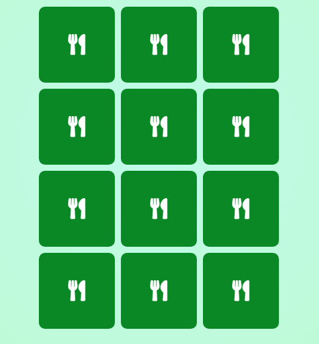
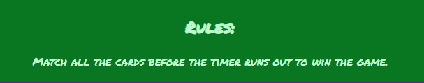
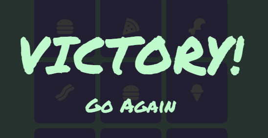
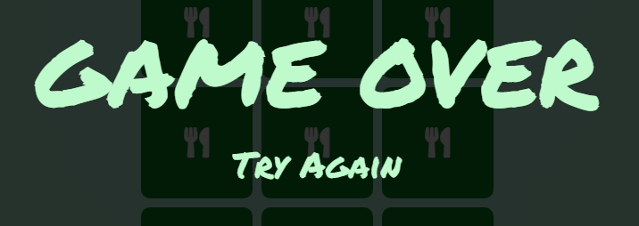

# Memory Game

This Memory Game was developed with a simple and charming food theme.
Every card when clicked will reveal a little food icon.
The idea is to be quick and easy, the timer adds enough pressure for the game to be challenging yet enjoyable.
Just match the cards within the time limit and you will have victory!

[Click here to try it out.](https://saltta.github.io/memorygame/)

# Features

This website was written using HTML5, CSS3 and JavaScript.

## Header

- The header shows the title of the game.
- It is big and bold to draw attention to itself once the game is opened.

## Game Stats

- The stats sit below the header and above the interactive part of the game.
- It displays how many seconds you have left to finish and how many cards you have flipped.

## Cards

- A total of 12 cards are displayed in 3 columns.
- Their backs are facing up until clicked on and they rotate revealing a different image.

## Footer

- The footer displays a quick instruction on what the objective is.

## Overlays

- Messages that prompt the player to start or restart the game.

# Testing

## Validators

I used the following validators to make sure there were no syntax errors in the project:

- The W3C Markup Validation Service:
- The W3C CSS Validation Service:
- JSHint:

## Lighthouse

I also checked the performance of the page using Chrome's Lighthouse.

- Mobile Results:
- Desktop Results:

## Bugs

### Favicon

After deploying via GitHub Pages I noticed my favicon was not being displayed in the deployed page although it worked on the test server.

This was fixed by adding this line of code:

    <link rel="shortcut icon" href="favicon.ico" />

The game was tested on Windows 10 and MacOS in Firefox and Chrome, as well as an Adroid phone running a Chrome based browser, there were no bugs reported.

# Deployment

 The site was deployed to GitHub pages. The steps to deploy are as follows: 
- In the GitHub repository, navigate to the Settings tab.
- In the left sidebar click on Pages.
- In the Source drop-down menu, select the Main branch.
- Click Save.

# Credits

## Content

- Text font was sourced from Google Fonts - https://fonts.google.com/specimen/Permanent+Marker
- The images for the cards were sourced from Font Awesome - https://fontawesome.com
- The hexadecimal colors were picked via ColorHexa - https://www.colorhexa.com/

## References

- Web Dev Junkie - [Live Coding a Memory Game: HTML, CSS, Javascript](https://fonts.google.com/specimen/Permanent+Marker)
- Code with Ania Kubów - [Make MEMORY GAME in JavaScript, HTML and CSS for your portfolio](https://www.youtube.com/watch?v=tjyDOHzKN0w)
-  freeCodeCamp - [Memory Card Game - JavaScript Tutorial](https://www.youtube.com/watch?v=ZniVgo8U7ek)
- Sandra Israel-Ovirih's article - [How to Build a Memory Matching Game in JavaScript](https://scotch.io/tutorials/how-to-build-a-memory-matching-game-in-javascript)
- Web Dev Simplified - [How to Code a Card Matching Game](https://www.youtube.com/watch?v=28VfzEiJgy4&t=0s)
- PortEXE - [How To Code A Card Game In Plain JavaScript - Spooky Halloween Edition](https://www.youtube.com/watch?v=3uuQ3g92oPQ)

