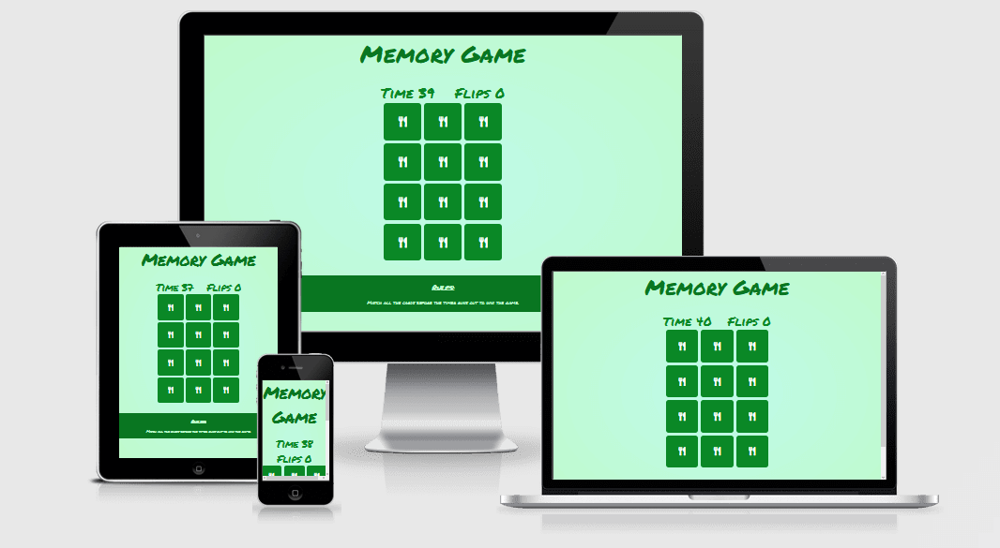

# Memory Game

This Memory Game was developed with a simple and charming food theme.
Every card when clicked will reveal a little food icon.
The idea is to be quick and easy, the timer adds enough pressure for the game to be challenging yet enjoyable.
Just match the cards within the time limit and you will have victory!

[Click here to try it out](https://saltta.github.io/memorygame/)

# Features

## Header

- The header shows the title of the game
- It is big and bold to draw attention to itself once the game is opened

## Game Stats

- The stats sit below the header and above the interactive part of the game
- It displays how many seconds you have left to finish and how many cards you have flipped

## Cards

- A total of 12 cards are displayed in 3 columns
- Their backs are facing up until clicked on and they rotate revealing a different image

## Footer

- The footer displays a quick instruction on what the objective is

## Overlays

- Messages that prompt the player to start or restart the game

# Testing

I used the following validators to make sure there were no syntax errors in the project:

- The W3C Markup Validation Service
- The W3C CSS Validation Service
- JSHint

