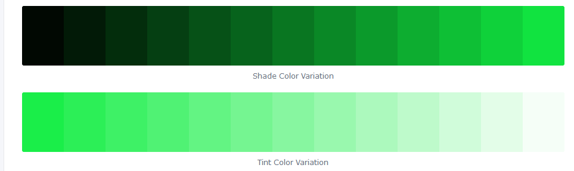
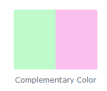
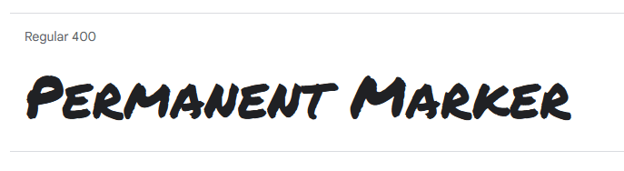
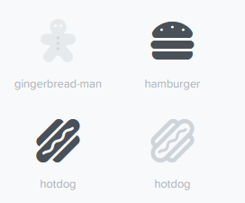
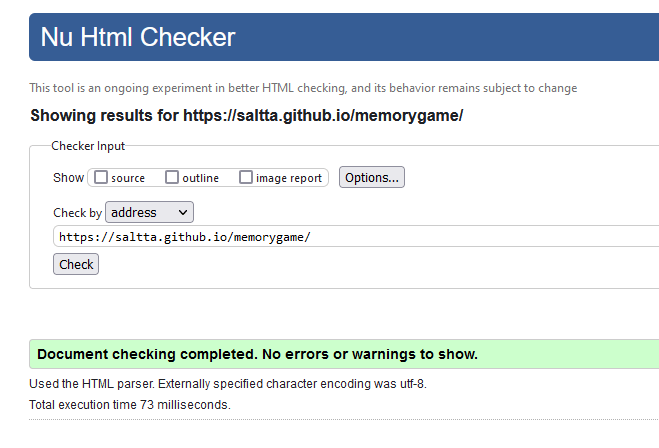
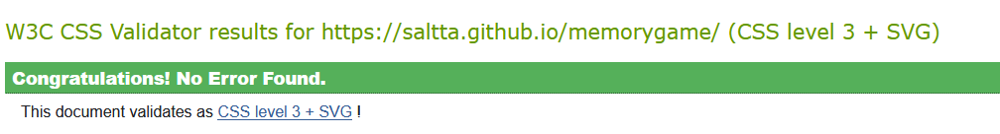
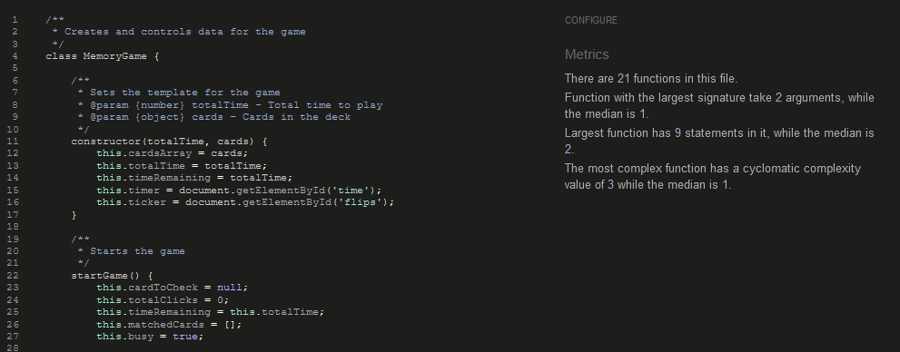
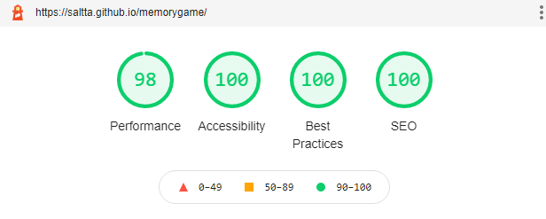
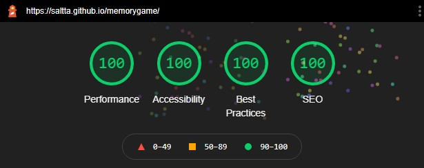
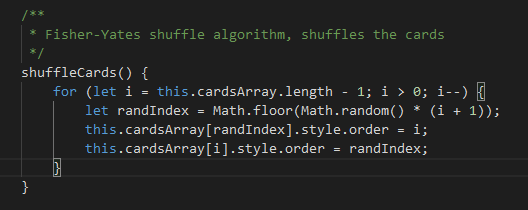

# Memory Game

This Memory Game was developed with a simple and charming food theme.
Every card when clicked will reveal a little food icon.
The idea is to be quick and easy, the timer adds enough pressure for the game to be challenging yet enjoyable.
Just match the cards within the time limit and you will have victory!

[Click here to try it out.](https://saltta.github.io/memorygame/)

# User Experience (UX)

## Objective

The main idea for the game is to be a simple entertainment. Nowadays we have really intricate and complex stories and everything is made with the intention to keep the user engaged.

This is a completely free-to-play game that is made to be quickly enjoyed and get the player's mind off of stress. No decisions to make, no path to follow, nothing but a little card game that is over in 45 seconds or less and can be played as many times as you want.

## Design Choices

The game was developed with simplicity at its core. which meant:

- No pictures
- Non-distracting color scheme
- Simple illustrations
- Fast to start
- Fast to finish
- Intuitive gameplay

With these things in mind I composed the layout.

### Color Scheme

As the face of the page I decided on different shades of green, which is a calm yet warmer color.

I selected tones that would contrast with each other and make the header and the stats very visible against the background.

For the front side of cards I chose a complementary color to make it very clear that the user was looking at the other side of the card.

### Typography

For the font I selected Permanent Marker from Google Fonts. I liked the handwritten aspect of it which was in line with the simplicity I had envisioned.

### Icons

The little food icons were chosen for their uncomplicated design. Simply put, they are cute. They contribute to the lightheartedness of the experience. 

They were sourced from Font Awesome.

# Features

This website was written using HTML5, CSS3 and JavaScript.

## Header

- The header shows the title of the game.
- It is big and bold to draw attention to itself once the game is opened.

## Game Stats

- The stats sit below the header and above the interactive part of the game.
- It displays how many seconds you have left to finish and how many cards you have flipped.

## Cards

- A total of 12 cards are displayed in 3 columns.
- Their backs are facing up until clicked on and they rotate revealing a different image.

## Footer

- The footer displays a quick instruction on what the objective is.

## Overlays

- Messages that prompt the player to start or restart the game.

# Testing

## Validators

I used the following validators to make sure there were no syntax errors in the project:

- The W3C Markup Validation Service:

- The W3C CSS Validation Service:

- JSHint - assuming new JavaScript features(ES6):

## Lighthouse

I also checked the performance of the page using Chrome's Lighthouse.

- Mobile Results:

- Desktop Results:

## Bugs

### Favicon

After deploying via GitHub Pages I noticed my favicon was not being displayed in the deployed page although it worked on the test server.

This was fixed by adding this line of code:

    <link rel="shortcut icon" href="favicon.ico" />

The game was tested on Windows 10 and MacOS in Firefox and Chrome, as well as an Adroid phone running a Chrome based browser, there were no bugs reported.

### Responsiveness

The original layout had 16 cards in 4 columns. To avoid having to scroll sideways on phones, it was adjusted via media query for smaller screens to only 2 columns, which made the page very long and the experience on a phone was hindered.

I made the cards smaller to be able to fit 3 columns on a mobile screen, but the 16 cards divided in 3 meant that 1 column had an extra card and didn't look appealing from a user's perspective.

Ultimately I decided to reduce the number of cards to 12, as well as the time to play the game from 60 to 45 seconds. It ended up being a positive change because the gameplay became more dynamic and could now fit into a smaller screen without having to scroll too much to be able to play.

# Deployment

 The site was deployed to GitHub pages. The steps to deploy are as follows: 
- In the GitHub repository, navigate to the Settings tab.
- In the left sidebar click on Pages.
- In the Source drop-down menu, select the Main branch.
- Click Save.

# Credits

## Content

- Text font was sourced from Google Fonts - https://fonts.google.com/specimen/Permanent+Marker
- The images for the cards were sourced from Font Awesome - https://fontawesome.com
- The hexadecimal colors were picked via ColorHexa - https://www.colorhexa.com/

## References

- Web Dev Junkie - [Live Coding a Memory Game: HTML, CSS, Javascript](https://fonts.google.com/specimen/Permanent+Marker)
- Code with Ania Kubów - [Make MEMORY GAME in JavaScript, HTML and CSS for your portfolio](https://www.youtube.com/watch?v=tjyDOHzKN0w)
-  freeCodeCamp - [Memory Card Game - JavaScript Tutorial](https://www.youtube.com/watch?v=ZniVgo8U7ek)
- Sandra Israel-Ovirih's article - [How to Build a Memory Matching Game in JavaScript](https://scotch.io/tutorials/how-to-build-a-memory-matching-game-in-javascript)
- Web Dev Simplified - [How to Code a Card Matching Game](https://www.youtube.com/watch?v=28VfzEiJgy4&t=0s)
- PortEXE - [How To Code A Card Game In Plain JavaScript - Spooky Halloween Edition](https://www.youtube.com/watch?v=3uuQ3g92oPQ)
- Fisher-Yates Shuffle - https://en.wikipedia.org/wiki/Fisher-Yates_shuffle

My shuffle code as explained by PortExe based on the Fisher-Yates Shuffle:

